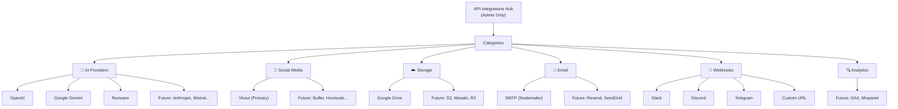
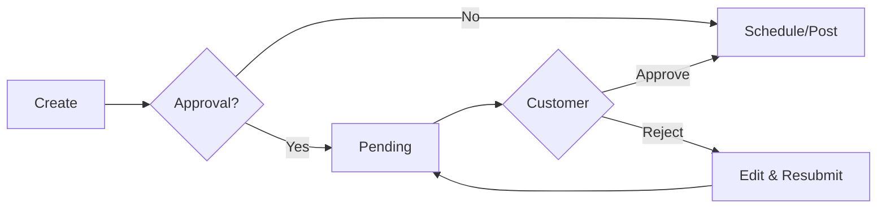

# ASocial - Social Media Management Platform (v5 Final)

Quản lý Social Media cho team & khách hàng. AI automation, đăng bài 10 nền tảng qua Vbout, cloud storage, real-time notifications.

---

## Technology Stack

| Layer | Technology |
|-------|-----------|
| **Framework** | Next.js 14 (App Router) + TypeScript |
| **Database** | PostgreSQL + Prisma ORM |
| **Queue/Cache** | Redis + BullMQ |
| **Auth** | NextAuth.js v5 (RBAC) |
| **UI** | Tailwind CSS + shadcn/ui |
| **State** | Zustand + React Query |
| **Calendar** | @fullcalendar/react |
| **Editor** | @tiptap/react |
| **Charts** | Recharts |
| **Real-time** | Socket.io (WebSocket) |
| **Email** | Nodemailer + react-email |
| **Image** | sharp (processing) + react-image-crop |
| **Upload** | react-dropzone (chunked) |
| **Table** | @tanstack/react-table |
| **i18n** | next-intl (VI + EN) |
| **Storage** | Google Drive (Phase 1), S3/Wasabi/R2 (future) |
| **AI** | OpenAI, Gemini, Runware |
| **Social** | Vbout API (15 req/sec) |
| **Deploy** | Docker Compose + Caddy (auto SSL) |

---

## Skills (10)

`ui-ux-pro-max` · `social-content` · `nextjs-app-router-patterns` · `prisma-expert` · `bullmq-specialist` · `tailwind-design-system` · `email-systems` · `i18n-localization` · `file-uploads` · `web-performance-optimization`

---

## Roles & Permissions

| Feature | Admin | Manager | Customer |
|---------|-------|---------|----------|
| **API Integrations Hub** | ✅ | ❌ | ❌ |
| Global Settings | ✅ | ❌ | ❌ |
| User Management | ✅ | ❌ | ❌ |
| Platform Accounts | ✅ | ❌ | ❌ |
| Channel CRUD & Settings | ✅ | ✅ | ❌ |
| Create/Edit Posts | ✅ | ✅ | ❌ |
| Approve/Reject Posts | ✅ | ❌ | ✅ (own) |
| Media Library | ✅ | ✅ | ✅ (view) |
| Calendar | ✅ | ✅ | ✅ (own) |
| Reports | ✅ | ✅ | ✅ (own) |
| Activity Log | ✅ | ✅ (own) | ❌ |
| Rate Limit Dashboard | ✅ | ❌ | ❌ |

---

## 🔌 API Integrations Hub (Centralized, Reusable)

> [!IMPORTANT]
> Hệ thống API Integrations thiết kế **tách biệt & module hóa** để tái sử dụng cho các app tương lai.



**Mỗi integration có:**
- API Key (encrypted AES-256)
- Base URL (customizable)
- Test Connection button
- Status indicator (Active/Error/Inactive)
- Usage counter + last used timestamp
- Rate limit config
- Per-channel override option

**Database model (reusable):**
```
APIIntegration {
  id, category, provider, name,
  api_key_encrypted, base_url, 
  config (JSONB), is_active, is_default,
  status, last_tested_at,
  usage_count, rate_limit_per_sec,
  created_at, updated_at
}

ChannelIntegrationOverride {
  id, channel_id, integration_id,
  api_key_encrypted, config (JSONB)
}
```

---

## Supported Platforms (10)

Facebook · Instagram · X (Twitter) · LinkedIn · TikTok · YouTube · Pinterest · Google Business Profile · Wistia · Vimeo

---

## Post Approval Workflow



---

## Database Schema (Final)

```mermaid
erDiagram
    User ||--o{ ChannelAccess : has
    User ||--o{ UserPreference : has
    User ||--o{ Notification : receives
    User ||--o{ ActivityLog : creates
    Channel ||--o{ ChannelAccess : grants
    Channel ||--o{ ChannelPlatform : has
    Channel ||--o{ ChannelIntegrationOverride : has
    Channel ||--o{ KnowledgeBase : has
    Channel ||--o{ ContentTemplate : has
    Channel ||--o{ HashtagGroup : has
    Channel ||--o{ Post : has
    Channel ||--o{ MediaItem : has
    Post ||--o{ PostMedia : has
    Post ||--o{ PostApproval : has
    Post ||--o{ PostPlatformStatus : has
    APIIntegration ||--o{ ChannelIntegrationOverride : overridden_by

    APIIntegration {
        string id PK
        string category "ai social storage email webhook analytics"
        string provider "openai gemini runware vbout gdrive smtp"
        string name
        string api_key_encrypted
        string base_url
        jsonb config
        boolean is_active
        boolean is_default
        string status "active error inactive"
        datetime last_tested_at
        int usage_count
        int rate_limit_per_sec
    }

    User {
        string id PK
        string email UK
        string name
        string password_hash
        enum role "ADMIN MANAGER CUSTOMER"
    }

    UserPreference {
        string id PK
        string user_id FK
        string theme "dark light"
        string locale "vi en"
    }

    Channel {
        string id PK
        string owner_id FK
        string name
        string display_name
        jsonb descriptions_per_platform
        string language
        jsonb vibe_tone
        jsonb seo_tags
        jsonb color_palette
        jsonb logo_prompts
        jsonb banner_prompts
        string notification_email
        boolean require_approval
        string storage_provider
        jsonb storage_config
        boolean use_default_storage
    }

    Post {
        string id PK
        string channel_id FK
        string author_id FK
        text content
        jsonb content_per_platform
        enum status "draft pending_approval approved rejected scheduled published failed"
        datetime scheduled_at
        boolean is_repeat
        int repeat_count
        int repeat_interval_days
        string content_hash "duplicate detection"
    }

    MediaItem {
        string id PK
        string channel_id FK
        string url
        string thumbnail_url
        string type "image video"
        string source "upload ai post"
        jsonb tags
        jsonb ai_metadata
        int file_size
    }

    ContentTemplate {
        string id PK
        string channel_id FK
        string platform
        string name
        text template_content
        jsonb variables
    }

    HashtagGroup {
        string id PK
        string channel_id FK
        string name
        jsonb hashtags
        int usage_count
    }

    Notification {
        string id PK
        string user_id FK
        string type "post_published post_failed approval_needed post_rejected"
        string title
        text message
        jsonb data
        boolean is_read
    }

    ActivityLog {
        string id PK
        string user_id FK
        string channel_id FK
        string action "post_created post_approved settings_changed"
        jsonb details
        string ip_address
    }

    Webhook {
        string id PK
        string name
        string url
        string platform "slack discord telegram custom"
        jsonb events
        string secret
        boolean is_active
    }

    Backup {
        string id PK
        string type "full channels posts"
        string file_url
        int file_size
        enum status "pending completed failed"
    }
```



---

## Development Phases (15)

| # | Phase | Scope | Dự kiến |
|---|-------|-------|---------|
| 1 | **Foundation** | Next.js + Prisma + Auth + Dark/Light + i18n + Docker | 3 ngày |
| 2 | **Design System** | UI/UX Pro Max → palette, fonts, components | 1 ngày |
| 3 | **API Integrations Hub** | Centralized API CRUD, encryption, test, status, usage | 3 ngày |
| 4 | **User Management** | CRUD users, roles, preferences | 1 ngày |
| 5 | **Channel Management** | Wizard, settings auto-save, KB, vibe, templates | 4 ngày |
| 6 | **Platform Integration** | Vbout client, 10 platforms, cached selector | 2 ngày |
| 7 | **Media Library** | Per-channel grid, upload, AI gen, search, reuse | 2 ngày |
| 8 | **Post Composer** | 3-column, AI content+image, bulk, schedule | 5 ngày |
| 9 | **Calendar** | Month/week, click detail, drag reschedule | 2 ngày |
| 10 | **Post Approval** | Workflow, email+realtime notify, customer portal | 2 ngày |
| 11 | **Notifications** | WebSocket/SSE, bell icon, notification panel | 2 ngày |
| 12 | **Reports & Analytics** | Per-channel, charts, engagement, export CSV | 2 ngày |
| 13 | **Automation** | BullMQ workers, auto-post, storage, email, webhooks | 3 ngày |
| 14 | **Activity Log + Monitoring** | Audit trail, rate limit dashboard, duplicate detection | 2 ngày |
| 15 | **Deploy & Backup** | Auto-setup script, SSL, first-run wizard, backup system | 2 ngày |

**Tổng ước tính: ~36 ngày**

---

## Verification Plan

### Automated
- `npm run test` — Vitest (unit + API)
- `npm run build` — Build check
- `npx prisma validate` — Schema
- `npm run lint` — ESLint + Prettier

### Browser Testing
1. Auth + dark/light mode + i18n toggle
2. API Integrations Hub (CRUD, test connection)
3. Channel wizard (AI → auto-save)
4. Post composer 3-column + media library
5. Calendar (month/week, drag)
6. Approval workflow
7. Real-time notifications
8. Reports + charts
9. Activity log
10. Rate limit dashboard

### Manual
1. Vbout API → đăng bài thực
2. Storage OAuth → upload file
3. SMTP → email notification
4. Webhooks → Slack/Discord
5. VPS auto-setup script
